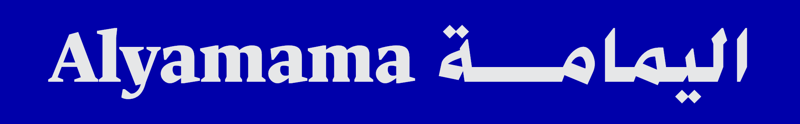
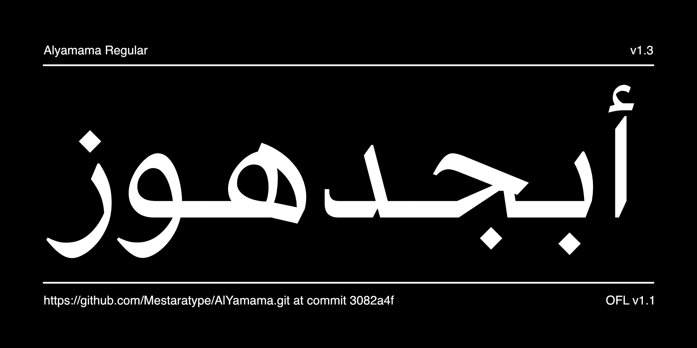
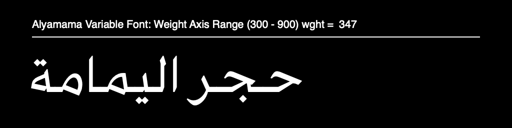

# Alyamama

[![][Fontspector]](https://mestaratype.github.io/AlYamama/fontspector/fontspector-report.html)
[![][OpenType]](https://mestaratype.github.io/AlYamama/fontspector/fontspector-report.html)
[![][Universal]](https://mestaratype.github.io/AlYamama/fontspector/fontspector-report.html)
[![][Google Fonts]](https://mestaratype.github.io/AlYamama/fontspector/fontspector-report.html)
[![][Glyphset]](https://mestaratype.github.io/AlYamama/fontspector/fontspector-report.html)

[Fontspector]: https://img.shields.io/endpoint?url=https%3A%2F%2Fmestaratype.github.io%2FAlYamama%2Fbadges%2FFontspectorQA.json
[OpenType]: https://img.shields.io/endpoint?url=https%3A%2F%2Fmestaratype.github.io%2FAlYamama%2Fbadges%2FOpentypeSpecificationChecks.json
[Universal]: https://img.shields.io/endpoint?url=https%3A%2F%2Fmestaratype.github.io%2FAlYamama%2Fbadges%2FUniversalProfileChecks.json
[Google Fonts]: https://img.shields.io/endpoint?url=https%3A%2F%2Fmestaratype.github.io%2FAlYamama%2Fbadges%2FFontFileChecks.json
[Outline Correctness]: https://img.shields.io/endpoint?url=https%3A%2F%2Fmestaratype.github.io%2FAlYamama%2Fbadges%2FOutlineCorrectnessChecks.json
[Glyphset]: https://img.shields.io/endpoint?url=https%3A%2F%2Fmestaratype.github.io%2FAlYamama%2Fbadges%2FGlyphsetChecks.json

**Alyamama**, is a variable Arabic typeface with a classic Naskh design with sharp, simple strokes that provide clarity and refined contrast, making it suitable for advertising, signage, and for both headlines and body text.

The Latin glyphs are based on the open-source typeface [**UNAL Ancízar**](https://github.com/UNAL-OMD/UNAL-Ancizar).

### Design Concept

 **Alyamama** typeface is a Naskh-style advertising font. This isn’t another Buotros Ads, Muna, or Al Mohannad Bold. **Alyamama** a new generation of Arabic typefaces that blend the elegance of traditional Naskh with modern design technolegies. Built as a variable font with clean, optimized outlines, it’s engineered for today’s high-resolution screens.

- **Variable font**: Alyamama supports infinite weight variations, allowing seamless interpolation between thin and bold styles.
- **Simplified and geometric**: Designed with minimal yet refined outlines that speed up text rendering and improve performance.
- **Optically adjusted**: Careful attention to spacing and stem heights ensures visual harmony and readability in both large display and small text sizes.
- **Calligraphic integrity**: Each glyph is carefully derived from the traditional Naskh style, preserving the beauty of Arabic calligraphy.
- **Wide forms**: Certain letters such as *مـ، هـ، ط* have been expanded for clarity at small sizes.

---

## Variable Font Axes

Radio-canada Display has the following axes:

Axis | Tag | Range | Default | Static Instances
--- | --- | --- | --- | ---
Weight | wght | 300 to 900 | 400 | Light, Regular, Semibold, Bold, ExtraBold, Black

#### `wght` (Weight) Axis

The `wght` axis spans Light (300) to Black (900).

---

## About

**Mestara** is a type foundry specialized in creating and designing Arabic typefaces. Founded by a professional calligrapher and designer, Mestara aims to reflect the beauty, and modernity while respecting traditional calligraphic principles. [Visit our website](https://mestara.com)

## Building

Fonts are built automatically by GitHub Actions - take a look in the "Actions" tab for the latest build.

If you want to build fonts manually on your own computer:

- `make build` will produce font files.
- `make test` will run [Fontspector](https://github.com/fonttools/fontspector)'s quality assurance tests.
- `make proof` will generate HTML proof files.

The proof files and QA tests are also available automatically via GitHub Actions - look at `https://mestaratype.github.io/AlYamama/`.

## License

This Font Software is licensed under the SIL Open Font License, Version 1.1.
This license is available with a FAQ at https://openfontlicense.org

## Repository Layout

This font repository structure is inspired by [Unified Font Repository v0.3](https://github.com/unified-font-repository/Unified-Font-Repository), modified for the Google Fonts workflow.
