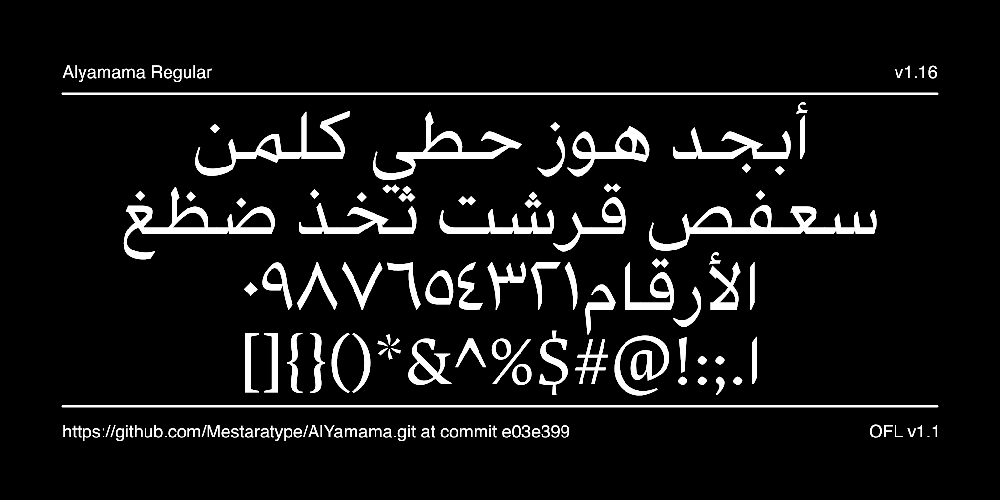

# My Font

[![][Fontspector]](https://mestaratype.github.io/AlYamama/fontspector/fontspector-report.html)
[![][OpenType]](https://mestaratype.github.io/AlYamama/fontspector/fontspector-report.html)
[![][Universal]](https://mestaratype.github.io/AlYamama/fontspector/fontspector-report.html)
[![][Google Fonts]](https://mestaratype.github.io/AlYamama/fontspector/fontspector-report.html)
[![][Glyphset]](https://mestaratype.github.io/AlYamama/fontspector/fontspector-report.html)

[Fontspector]: https://img.shields.io/endpoint?url=https%3A%2F%2Fmestaratype.github.io%2FAlYamama%2Fbadges%2FFontspectorQA.json
[OpenType]: https://img.shields.io/endpoint?url=https%3A%2F%2Fmestaratype.github.io%2FAlYamama%2Fbadges%2FOpentypeSpecificationChecks.json
[Universal]: https://img.shields.io/endpoint?url=https%3A%2F%2Fmestaratype.github.io%2FAlYamama%2Fbadges%2FUniversalProfileChecks.json
[Google Fonts]: https://img.shields.io/endpoint?url=https%3A%2F%2Fmestaratype.github.io%2FAlYamama%2Fbadges%2FFontFileChecks.json
[Outline Correctness]: https://img.shields.io/endpoint?url=https%3A%2F%2Fmestaratype.github.io%2FAlYamama%2Fbadges%2FOutlineCorrectnessChecks.json
[Glyphset]: https://img.shields.io/endpoint?url=https%3A%2F%2Fmestaratype.github.io%2FAlYamama%2Fbadges%2FGlyphsetChecks.json

**Alyamama**, is a variable Arabic typeface with a classic Naskh design with sharp, simple strokes that provide clarity and refined contrast, making it suitable for advertising, signage, and for both headlines and body text.

The Latin glyphs in **Alyamama** are based on the open-source  typeface [**UNAL Ancízar**](https://github.com/UNAL-OMD/UNAL-Ancizar).  

## Design Concept

 **Alyamama** typeface is a Naskh-style advertising font similar to (e.g., Buotros Ads, Muna, Al Mohannad Bold, Sakkal Majalla). However, Alyamama sets itself apart with a more streamlined and geometric structure, offering improved legibility and performance in modern digital environments.

- **Variable font**: Alyamama supports infinite weight variations, allowing seamless interpolation between thin and bold styles.
- **Simplified and geometric**: Designed with minimal yet refined outlines that speed up text rendering and improve readability.
- **Optically adjusted spacing**: Careful attention to spacing ensures excellent performance in both large display settings and small sizes.
- **Calligraphic integrity**: Each glyph is carefully referenced from the classical Naskh style, preserving the heritage of Arabic calligraphy.
- **Wide forms**: Certain letters such as *مـ، هـ، ط* have been expanded for clarity at small sizes.

---

## About

**Mestara** is a type foundry specialized in creating and designing Arabic typefaces. Founded by a professional calligrapher and designer, Mestara aims to reflect the beauty, and modernity while respecting traditional calligraphic principles. [Visit our website](https://mestara.com)

## Building

Fonts are built automatically by GitHub Actions - take a look in the "Actions" tab for the latest build.

If you want to build fonts manually on your own computer:

- `make build` will produce font files.
- `make test` will run [Fontspector](https://github.com/fonttools/fontspector)'s quality assurance tests.
- `make proof` will generate HTML proof files.

The proof files and QA tests are also available automatically via GitHub Actions - look at `https://mestaratype.github.io/AlYamama/`.

## License

This Font Software is licensed under the SIL Open Font License, Version 1.1.
This license is available with a FAQ at https://openfontlicense.org

## Repository Layout

This font repository structure is inspired by [Unified Font Repository v0.3](https://github.com/unified-font-repository/Unified-Font-Repository), modified for the Google Fonts workflow.
